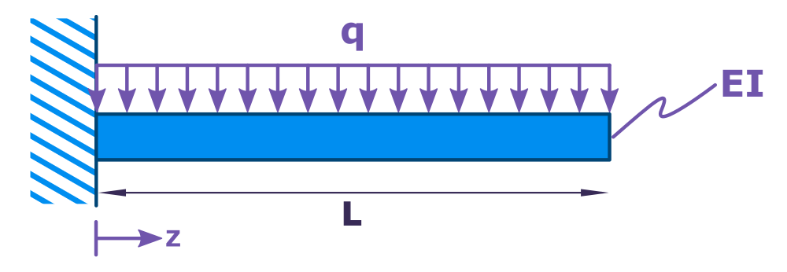
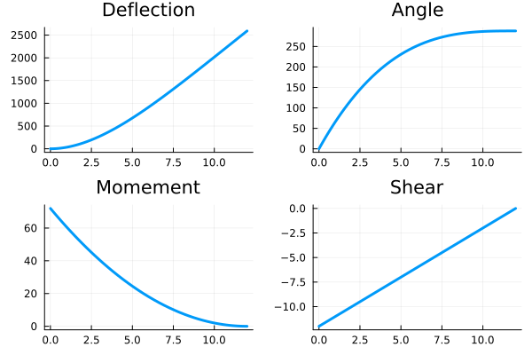
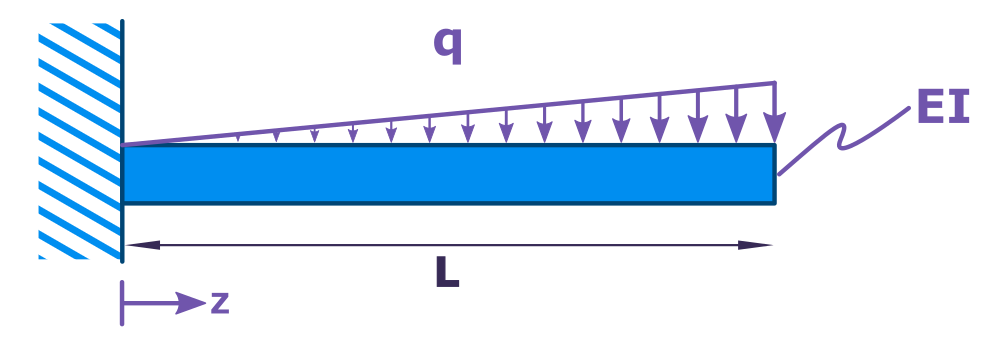
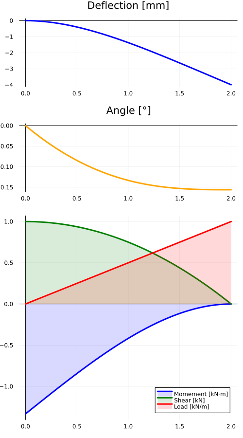

+++
title = "Solving Beam Deflection"
date = 2021-03-16

[taxonomies]
tags = ["Julia", "engineering"]

[extra]
math = true
image = "/blog/beam-deflection-01/beam_deflection_01_fig1.png"
+++

This started as a challenge on the Julia Discourse website to come up with a compelling application for Julia in seven lines of code. I had wanted a reason to learn more about the [ApproxFun.jl](https://github.com/search?q=ApproxFun.jl&type=Repositories) package and took this as a fun opportunity.

## The Problem

[ApproxFun.jl](https://github.com/search?q=ApproxFun.jl&type=Repositories) is well suited to finding the solutions of ordinary differential equations (ODEs) with boundary conditions. One application for this is solving beam deflection under various loading conditions. As a test case, here's a simple beam deflection problem: a cantilevered beam with uniform loading. The beam has length, L, and its stiffness is determined by both the elastic modulus, E, and the moment of inertia, I.




## My Seven Lines (excluding imports)

```julia
using ApproxFun, Plots
L, E, I = 12.0, 1.0, 1.0
d = 0..L
z = Fun(identity, d)
B = [[Evaluation(d,0,k) for k=0:1]... ; [Evaluation(d,L,k) for k=2:3]... ;]
v = [B; E*I*Derivative()^4] \ [ zeros(4)...; one(z)]
func_name = zip([v, v', v'', v'''], ["Deflection", "Angle", "Moment", "Shear"])
plot([plot(z, f, title=n, label="") for (f,n) in func_name]..., lw=3)
```



## What It's Doing

The seven lines are bit compressed to fit within the constraints of the challenge so let's walk through it.

These four lines are the simplest. The first line imports the required packages: `ApproxFun`, `Plots`. Next we define variables for the length, elastic modulus, and moment of inertia for the beam. The variable, d, is the domain of the ODE, in this case from `0` to `L`. The last line in this group creates an `ApproxFun` function called `z` across the domain. This function is simply the distance along the beam.

```julia
using ApproxFun, Plots
L, E, I = 12.0, 1.0, 1.0
d = 0..L
z = Fun(identity, d)
```

`B` is an array of boundary conditions for our ODE. It's a fourth order ODE, so there are four boundary conditions. The vertical displacement and first derivative (ie, angle) are both zero at the fixed end of the beam. The moment and shear in the beam (2nd and 3rd) derivatives are zero at the free end of the beam.

```julia
B = [[Evaluation(d,0,k) for k=0:1]... ; 
     [Evaluation(d,L,k) for k=2:3]... ;]
```

The solution is generated on the next line. The boundary conditions, B, are all set to 0 using `zeros(4)...`. The differential equation for a beam is defined (`E*I*Derivative()^4`) and gets set to a uniform load `one(z)` (shown as **q** in the image above).

```julia
v = [B; E*I*Derivative()^4] \ [ zeros(4)..., one(z)]
```

These two lines plot the results. I've zipped together the solution and its derivatives with their corresponding labels. The last line uses list comprehension to plot the results. Note: I wouldn't typically use syntax like this for plotting but I had to fit this whole thing into seven lines. A little bit of clarity went out the window.

```julia
func_name = zip([v, v', v'', v'''], ["Deflection", "Angle", "Moment", "Shear"])
plot([plot(z, f, title=n, label="") for (f,n) in func_name]..., lw=3)
```

## Beam Deflection - More Breathing Room

When not constrained to seven lines of code, it's much easier to document and read this Julia code. The code below show a 2 meter long beam with load which increases from 0 at the fixed end to 1 kN/m at the end of the beam. Here's a diagram of the problem setup.



```julia
using ApproxFun, Plots
° = π/180;

# Setting up problem
L = 2.0                 # Length in m
E = 82.74e9             # Elasticin Pa
I = 444.0 * (0.01)^4    # Moment of interia m⁴
d = 0..L                # Domain of beam
z = Fun(identity, d)    # Length along beam in m
D = Derivative()

# Problem Definition
q = 1000*(z/L)          # Triangular loading in N/m
w = E*I*D^4             # DiffEq for beam deflection

# Boundary Conditions
B= [Evaluation(d, 0, 0) # Beam vertically constrained at z = 0
    Evaluation(d, 0, 1) # Beam's angle is constrained at z = 0
    Evaluation(d, L, 2) # Beam's moment is 0 at z = L
    Evaluation(d, L, 3)]# Beam's shear is 0 at z = L

# Solving for vertical displacement
v = [B; w] \ [ zeros(4)...; -q]

# Renaming and scaling variables
θ, M, V = (v'/°),(v''*E*I), (v'''*E*I)

# Plotting
p1 = plot(z, 1000v, legend=:none, 
    title="Deflection [mm]", lc=:blue)
p2 = plot(z, θ, legend=:none, 
    title="Angle [°]", lc=:orange)

plot(z, M/1000, label="Moment [kN⋅m]",
    fill = (0, 0.15, :blue),  lc=:blue)
plot!(z, V/1000, label="Shear [kN]",
    fill = (0, 0.15, :green), lc=:green)
p3 = plot!(z, q/1000, label="Load [kN/m]", 
    fill = (0, 0.15, :red),   lc=:red,
    legend=:bottomright)

l = grid(3, 1, heights=[0.2, 0.2 ,0.6])
plot(p1, p2, p3, layout=l,  lw = 3, size=(500, 900), frame=:zerolines)
```



## Next Steps

 * I would like to play around with more supporting and loading conditions. In particular, I want to figure out how to have a support in the middle of the beam. I believe I need to solve this problem piecewise when there are supports in the middle of the beam.
 * I want to see if ApproxFun can solve some more complicated examples. It should be able to solve the 2D version of this problem - plate deflection.
 * Adding [Units.jl](https://github.com/search?q=Units.jl&type=Repositories) or [Measurements.jl](https://github.com/search?q=Measurements.jl&type=Repositories) should allow me to calculate beam deflections with units and error propagation.
