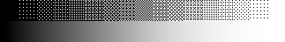
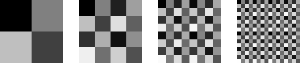
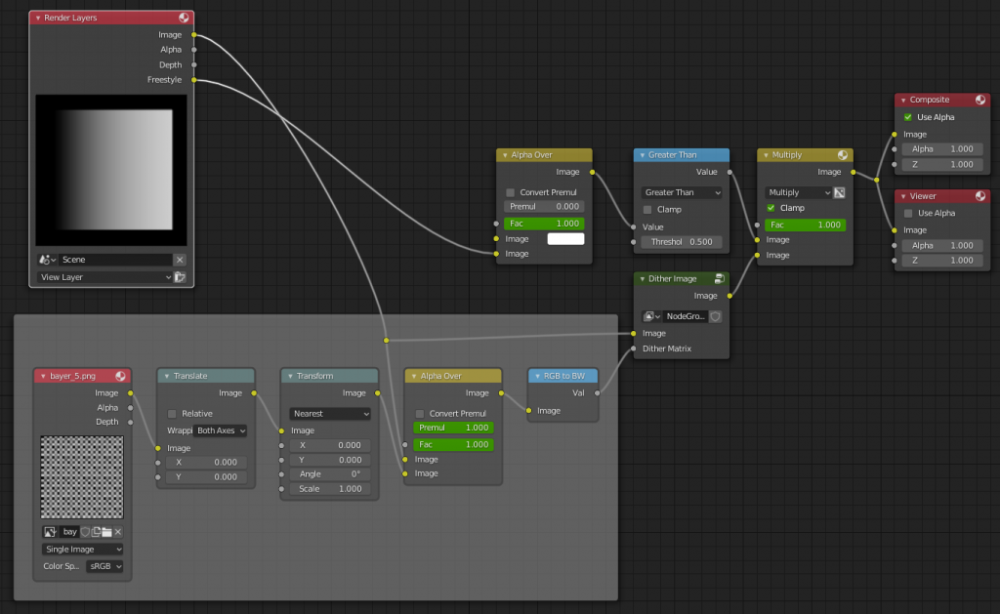
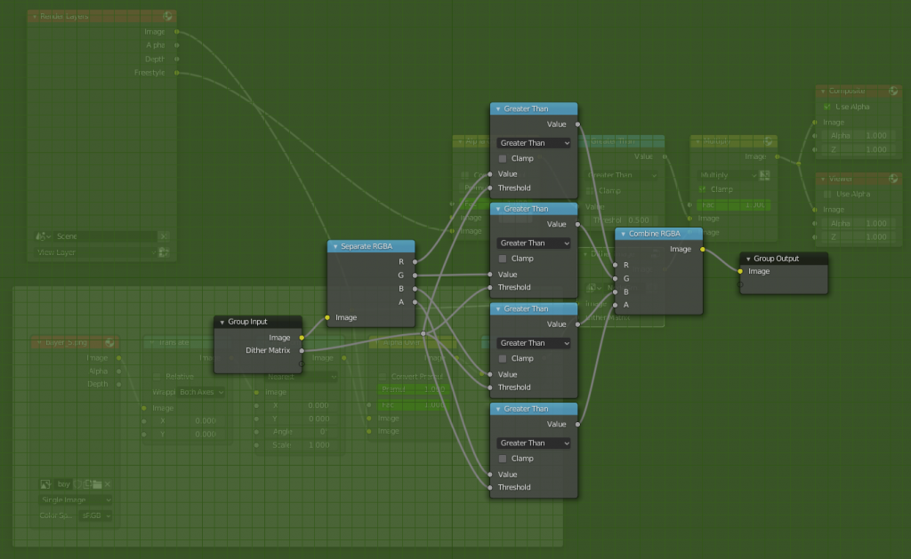
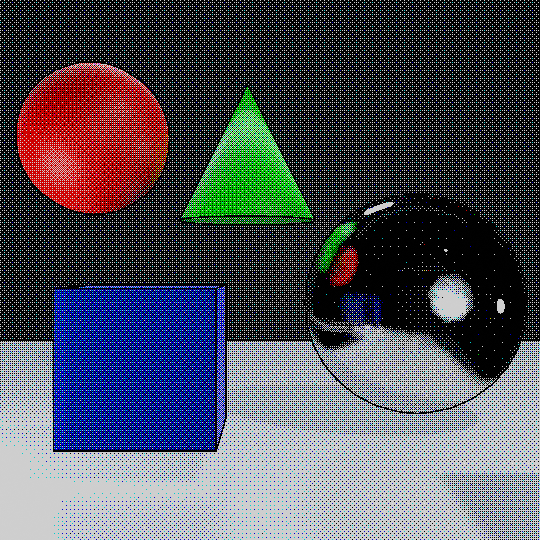

+++
title = "Dithering in Blender"
date = 2020-06-13

[taxonomies]
tags = ["Blender", "Julia"]

[extra]
image = "/blog/blender-dithering-01/blender_dithering_01_fig7.gif"
+++

I wanted to create a 3D render which emulated the retro video game aesthetic. To accomplish this I created a compositing node setup in Blender to apply ordered dithering to an image. Below is a description of what dithering is and how it can be applied to a rendering in Blender using compositing nodes. Note: I have the image files of the dither matrices needed for this effect free to download below so that you don't need to recreate them.

## What is Dithering?

Dithering an image is adding noise to it. Typically we want as little noise in an image as possible, so why would we want to add noise? Early computer displays had a limited number of colors that could be displayed. If you wanted to smoothly blend one color into another, this limited color palette would result in blocks colors with large jumps between colors. This is is know as color banding. This color banding is the visual result of quantization error. Quantization error occurs when a smoothly varying input value is rounded to a limited number of output levels.

Images with this color banding are accurate at the pixel level. That is, every pixel is displayed with the color as close to the original as possible (minimal pixel quantization error). But this per-pixel accuracy often results in very ugly images. Instead consider treating a block of pixels as a unit instead of the single pixel. We perceive the average of a block of pixels and this pixel grouping allows for more possible perceived gradations. The dithered gradient in the image below is composed of only black and white pixels, but the blocks of pixels are perceived as gradations of grey. So while dither causes the quantization error of the image to increase at the pixel level, the result is perceived as closer to the input gradient. Thus dithering is adding noise to an image in such a way that it reduces the perceptual cost of quantization errors.



There are two way to think about this dithering noise: adding noise and then rounding or having a different threshold across a block of pixels. To dither a block of pixels we can add a block of noise and round up and down with a threshold of 50%. The noise we add is set up so that a block of 50% grey pixels would have half its pixels rounded up to white and half its pixels rounded down to black. Similarly, a block of 25% percent grey would have noise added such that rounding with a 50% threshold results in about 25% of the pixels being white. The other way to think about this having a different threshold for each pixel within a block. These methods are equivalent, but I wanted to make it clear that the threshold matrices that I am creating below have the effect of adding noise.

## Dithering Matrices

```julia
using Images

function bayer_matrix(size=1)
    M = [0 2; 3 1]
    
    for i=2:size
        M = @. [(4*M) (4*M+2); (4*M+3) (4*M+1)]
    end
    return M./ 2^(2*size)
end

img_size = 128
imgs = []
for n = 1:4
    bm = bayer_matrix(n)
    reps = convert(Int, img_size/2^n)
    bm = repeat(bm, inner=(reps,reps))
    push!(imgs, bm)
end
padimg = ones((128, 32))
output = hcat(imgs[1], padimg, imgs[2], padimg, imgs[3], padimg, imgs[4])
save(joinpath(@__DIR__, "output", "blender_dithering_fig2.png"), colorview(Gray, output))
```



I created a quick function in Julia to create different threshold maps. These threshold maps (Bayer matrices) are square grey-scale images that are repeated to fill a region. The input image is compared pixel-by-pixel to the threshold map and set to white if it's above the pixel in the map and black if it's below the value in the map. The algorithm on the right can create threshold maps of many different sizes. This algorithm starts with a 2-by-2 matrix and iteratively expands the matrix by two in each dimension to reach a desired size. The final step is dividing the matrix by an appropriate factor of two to yield values between zero and one.

## Blender Compositing with Dithering

Below are two images of the default Blender monkey Suzanne with and without dithering. The image on the left has no dithering, so any pixel above the threshold of 50% grey is set to white. The image on the right is still composes of only black and white pixels, but the dither produces the appearance of fine gradations of grey. I added a rendering pass to draw lines around certain contours of the model to give the model more form and produce a retro line art and shading appearance.

{{ fig_group(srcs=["blender_dithering_01_fig3a.png", "blender_dithering_01_fig3b.png"], alts=["Without Dithering", "With Dithering"]) }}

## Send Nodes

Here are the Blender image compositor node setup for to produce the results above.





## More Results

{{ fig_group(srcs=["blender_dithering_01_fig6a.png", "blender_dithering_01_fig6b.png", "blender_dithering_01_fig6c.png"], alts=["Color Wheel Input", "Color Wheel Quantized", "Color Wheel Dithered"]) }}


