+++
title = "Isometric Pixel Art in Blender"
date = 2021-04-11

[taxonomies]
tags = ["Blender"]

[extra]
image = "/blog/blender-isometric-pixel-art-01/blender_isometric_pixel_art_01_fig17.gif"
+++

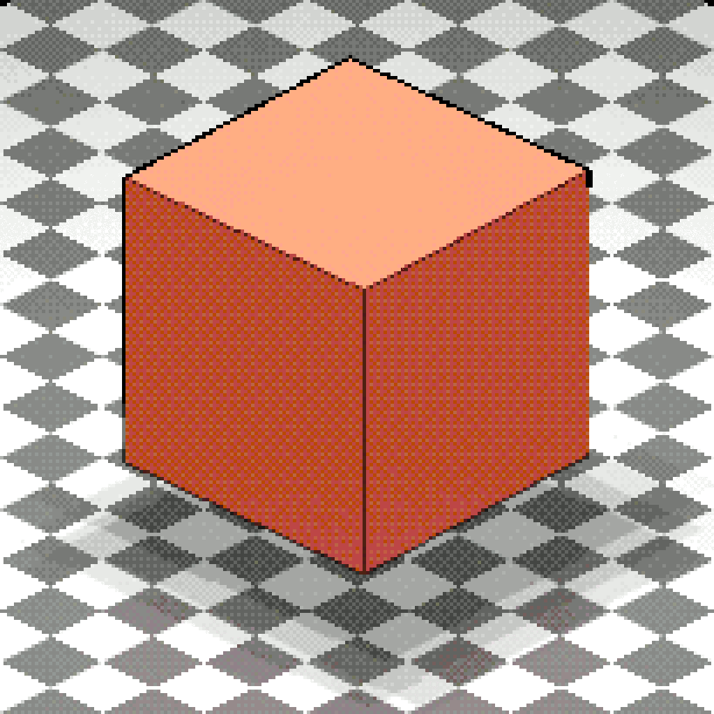

Limitation spurs creativity. I think this is why sonnets and haiku continue to be popular modes of expression. In the same spirit, pixel art is a creative limitation that has bred incredible creativity and attention to detail. Let's automate it!

Okay... there's no replacement for hand-made pixel art. A single pixel can dramatically change the look and feel of pixel art. That being said, pixel art stylized render could serve as an excellent starting point. I've found quite a few people creating incredible pixel art using Blender. I'm neither an artist nor a game designer, and I don't claim that the results below are pixel perfect. I just like the pixel art aesthetic and wanted to see how far I could stretch Blender to create stylistic renders. The results I have so far are pretty promising and figured I'd share them.

If this was as simple as pixelating a 3D render, then this would be over and done with in a matter of seconds. The Blender compositor already has a pixelate node. To apply a simple pixelation effect image must first be scaled down, pixelated, and then scaled up again by the reciprocal amount (nodes show below).

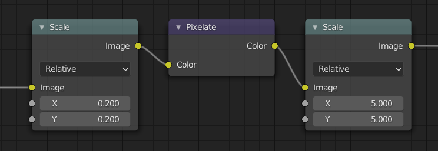

Pixel art typically uses outlines around objects to offset them from the background. There may also be lines within the object to demarcate hard edges. It's also common in pixel art to have a limited palette. Both of the outlines and color limitation effects can be replicated with a little bit of extra effort in the Blender compositor. To clean up the compositing tree, I grouped together the nodes for the pixelation effect with a division node to form my own pixelate node group.

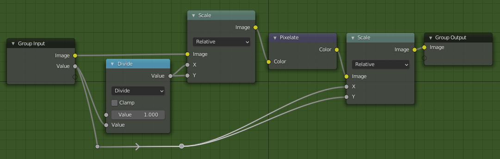

## Camera Setup

If you want your scene to be isometric, set your camera to be **Orthographic** in the camera object data properties tab. The rotation of the camera should also be set to **60°** around the x axis and **45°** around the z axis. Actually any angle 45° off-axis from the x and y axes will work, viz. 45°, 135°, 225°, or 315°. With this camera mode and orientation, lines parallel to the x or y axes will have a slope of exactly $\frac{1}{2}$. That is, they run horizontally two pixels before jumping up one pixel. To adjust what's in and out of frame, you can move the camera around and adjust the orthographic scale of the camera.

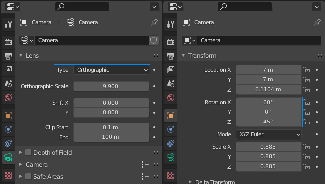

## Compositing Nodes

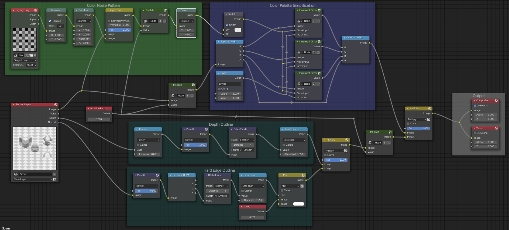

## Outlines

Early in my experimentation I had used a cryptomatte workflow to isolate a single object and create an outline around it. The problem with this workflow is that it only worked for the object I happen to select, not automatically for all objects within my scene. If you only wanted to outline a single object such as a character sprite, then cryptomatte workflow is your friend.

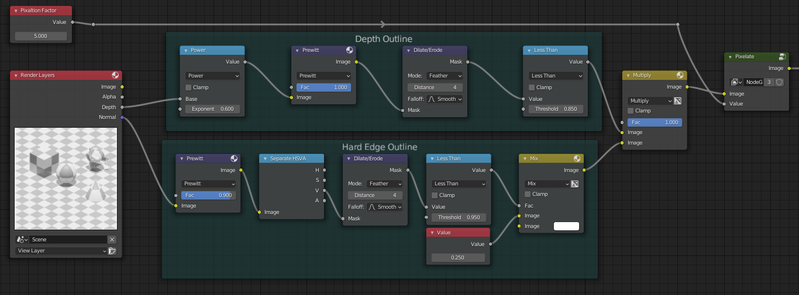

I am creating two sets of linework. One set of lines outlines an object from the background based on a difference in depth. The other set of lines occur where there are hard edges. The general pattern I am using to create outlines is to use an edge detection filter on some input, dilate the detected edges, and then apply the less than operator with some threshold to force the value to either black or white. For the depth outline, I use the depth data from the render layers as an input. I found it helps to correct the depth data with a power math node. For the hard edge outlines, I'm using the normal data from the render layers. The final touch is to make the hard edge outlines a shade of grey (set to 25% grey here). Since the hard edge outlines can occur within an object I don't want to make the output cluttered with dark lines. The thickness of the edges can be modified by adjusting the dilate/erode node and less than nodes. I just adjusted the settings on these nodes until I achieved a single pixel wide line.

{{ fig_group(srcs=["blender_isometric_pixel_art_01_fig7a.png", "blender_isometric_pixel_art_01_fig7b.png", "blender_isometric_pixel_art_01_fig7c.png", "blender_isometric_pixel_art_01_fig7d.png"], alts=["Depth outlines", "Hard edge outlines", "Combined outlines", "Combined outlines pixelated"]) }}

## Color Simplification

### Simple Method

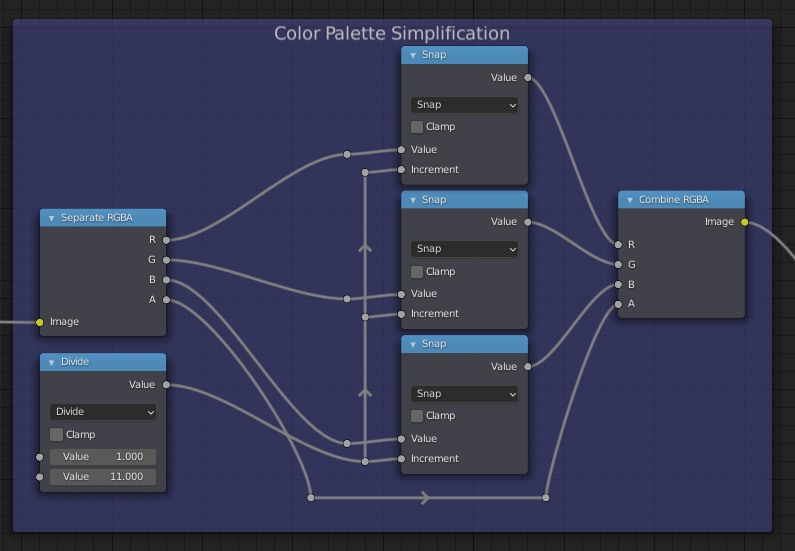

Simplifying the colors can be quite simple. We can separate the color channels of an input and then round each pixel to a subset of values using the snap math node. This cuts down the number of possible colors. Unfortunately, this results in ugly banding that I discussed in a previous post. To summarize, instead of the typical 256 different values a pixel can have for each channel, we round the values for channel to just a handful of steps. This produces large jumps between adjacent colors. Areas where the color is meant to transition slowly (like on the ball shown below) produce large bands of color with large jumps in color between the bands.

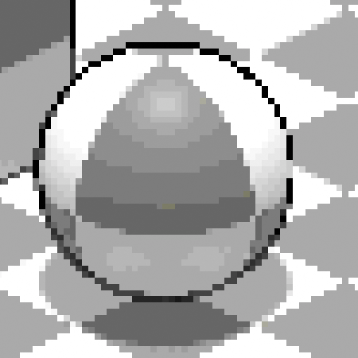

### Dithered Method

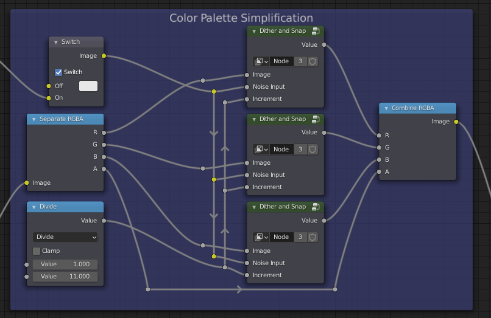

There is a rather simple fix. We don't perceive each pixel in isolation; instead we tend to perceive the average of a block of pixels. If we add a little bit of noise to the image before we round it to discrete steps, this breaks up the monotonous banding. The two spheres above and below have the same number of colors, but the sphere below has noise added to it to break up the banding. This process of adding noise to an image to break up color banding is called dithering.

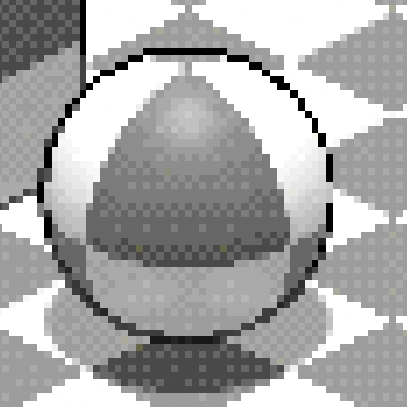

I created another node group called **Dither and Snap** (details shown below). We first multiply the noise input by the increment used to round values. This means that the noise we add only can only change a pixel's value by at most the width of the step sizes. We add this noise to the image before snapping the value to increments. This is done for each color channel with the same increment and input noise.

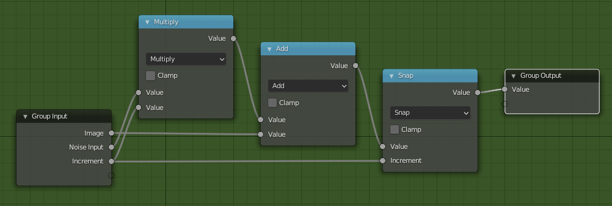

## Dithering

The remaining question is what noise should we add to our image? We want the light and dark pixels to be spread out and intermingled across the input noise. This way we can avoid creating patches that are accidentally a little darker or lighter. Another way of saying this is we want the noise to average close to zero not only across the whole noise pattern but also small blocks of pixels within the pattern. Well, fortunately this has been figured out for us already. A Bayer matrix is an excellent choice because it balances out the average value across the whole matrix. If you want to learn how to make these matrices yourself or download images that are ready to use: [check out my previous post](/blog/blender_dithering_01/).

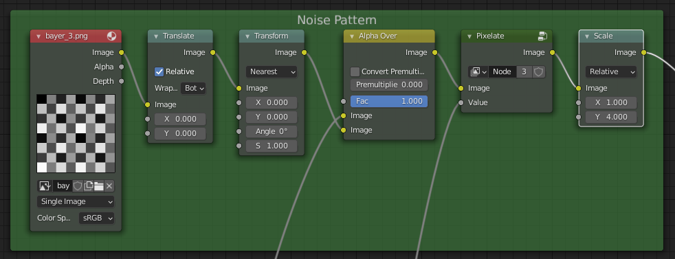

The final touch to this the dithering is to stretch out the dithering noise with a scale node. This is entirely optional and some of the images above are produced without this scaling. The images below show different settings for this final noise scaling: without scaling, vertical scaling by four pixels, and horizontal scaling by four pixels. I personally like the vertical scaling by 4 pixels. It complements the isometric style nicely.

{{ fig_group(srcs=["blender_isometric_pixel_art_01_fig11.png", "blender_isometric_pixel_art_01_fig14.png", "blender_isometric_pixel_art_01_fig15.png"], alts=["No scaling of dithering noise", "Four-pixel vertical scaling", "Four-pixel horizontal scaling"]) }}

## More Results

{{ fig_group(srcs=["blender_isometric_pixel_art_01_fig16.gif", "blender_isometric_pixel_art_01_fig17.gif"], alts=["Spiral staircase animation with a Freestyle line pass", "Rotating torus"]) }}
