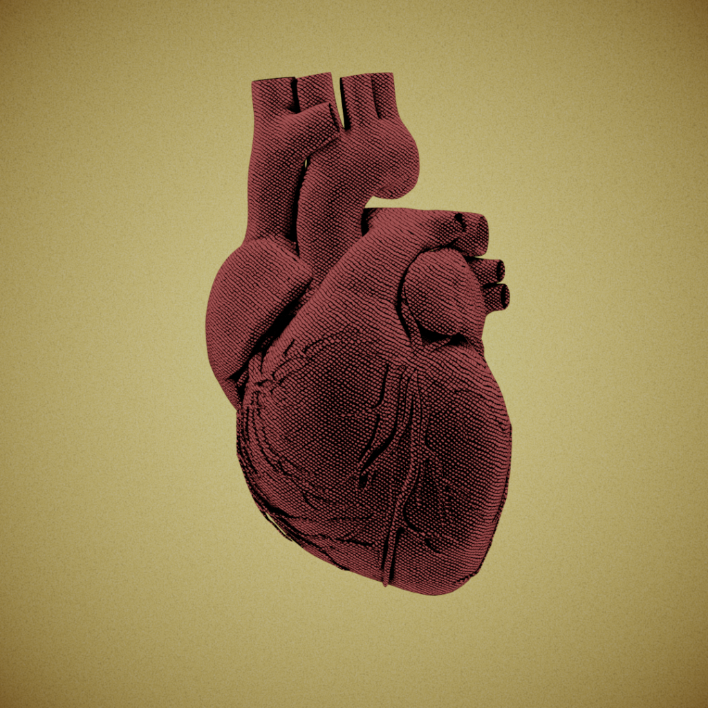
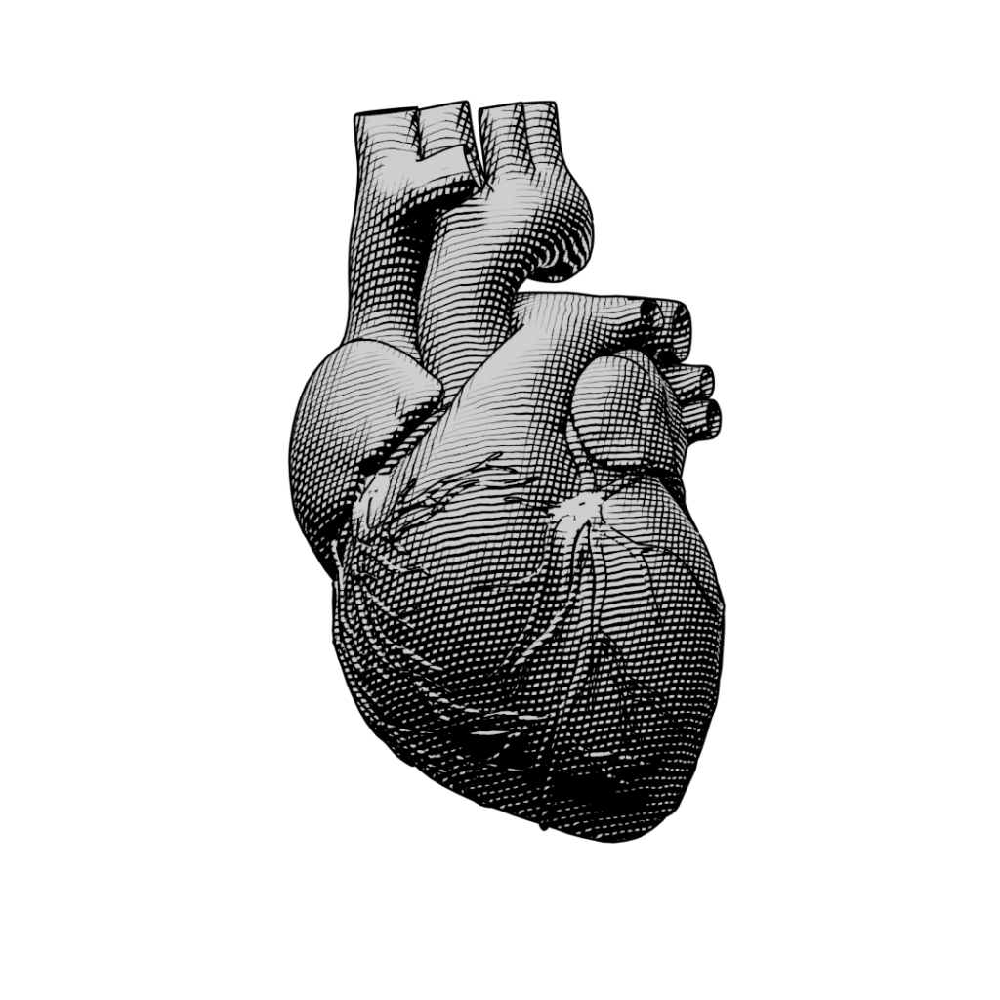
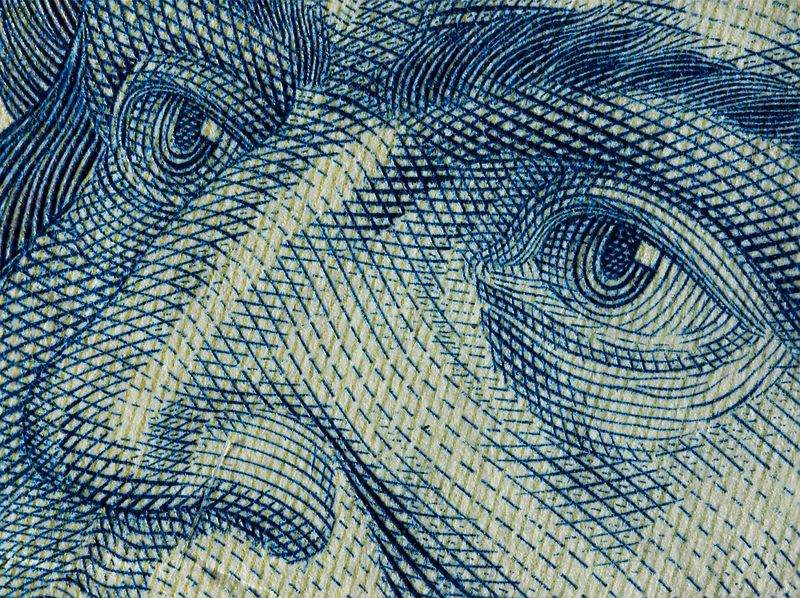

+++
title = "Adventures in Non-photorealistic Rendering"
date = 2020-01-15

[taxonomies]
tags = ["Blender"]

[extra]
math = true
image = "/blog/blender-npr-01/blender_npr_01_fig1.png"
+++

<!-- ~~~ 

~~~ -->

<!-- ~~~ 

~~~ -->

Here's a quick experiment with a non-photorealistic rendering (NPR) of a heart using Blender. I created a custom shader to render 3D objects in the style of intaglio printing. You've likely seen intaglio before without knowing the name. It's the style of printmaking most associated with the portraits on currency.

Inspiration for this project came from the Blender NPR YouTube channel and Blender community. This is very much a work in progress. I am working on gaining greater control over the line direction.
