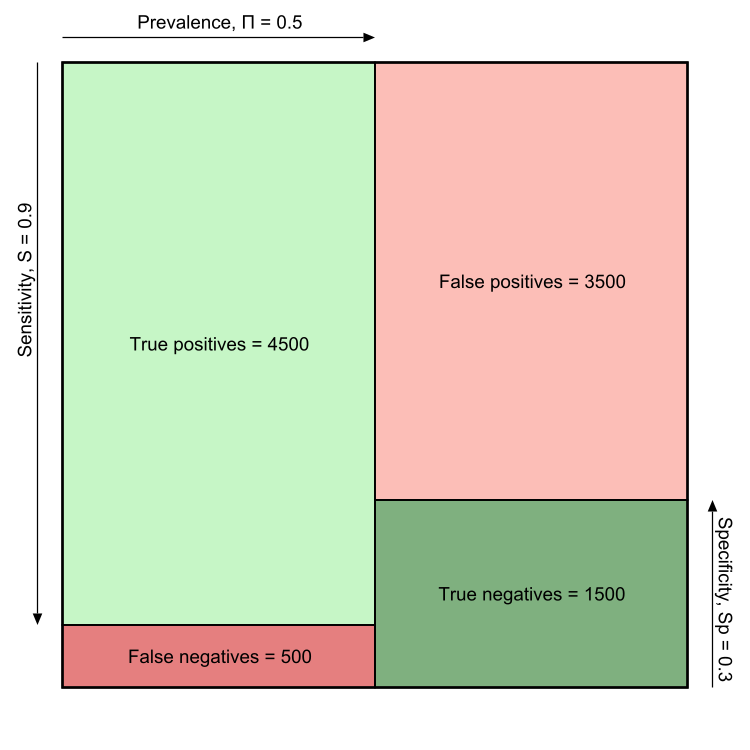

+++
title = "Diagnostic Tests, Visualized"
date = 2020-01-15

[taxonomies]
tags = ["Julia"]

[extra]
math = true
image = "/blog/diagnostic-tests-01/diagnostic_tests_01_fig1.png"
+++

<!-- # Diagnostic Tests, Visualized -->

Diagnostic tests are invaluable tools in our medical arsenal, but they are not without pitfalls. These tests can be used to identify diseases in their early states or eliminate competing diagnoses to find the correct treatment course. However, no test is perfect. When a healthy person receives a positive result, this can result in anxiety, additional (often invasive) tests, and occasionally misdiagnosis/over-treatment.

## Let's look at an example:

The numbers for this example come from an open-access article.[^1]

 * 50% of people have the condition  * that we're screening for ( * "Prevalence" or $\Pi$)
 * 90% of people with the disease  * will be correctly identified as  * having the condition ( * "Sensitivity" or $S$)
 * 30% of people without the disease will be correctly identified as being healthy ("Specificity" or $Sp$)

If we give the screening test to 10,000 people, we would expect the following results:

<!-- TODO: Fix table layout -->
	
|                   | Have Condition      | Healthy              | Row Totals |
|------------------:|:--------------------|:---------------------|-----------:|
| **Positive Test** | 4500 True Positive  | 3500 False Negative  | 8000       |
| **Negative Test** | 500  False Negative | 1500 True Negative   | 2000       |
| **Column Totals** | 5000                | 5000                 | 10000       |

For a given diagnostic test, there are many related parameters that we might care about. Some of these terms include prevalence, sensitivity, false negative rate, specificity, false positive rate, accuracy, likelihood ratio, and much more. I'm a visual person and wanted a way to represent these parameters and their relationships visually.

The visualization below demonstrates the performance of diagnostic tests with relevant parameters marked along the outside of the square.

 * The square represents all people that receive our diagnostic test
 * The left column represents the people with the condition.
 * The right column represents healthy people.
 * The green regions represent *correct* test results.

I'm working on an interactive version of this chart, so stay tuned. My hope is that being able to play with each parameter will result in a deeper intuition for how these parameters relate.

## Referenced Articles:

[^1]: [Maxim LD, Niebo R, Utell MJ. Screening tests: a review with examples. Inhal Toxicol. 2014;26(13):811-828. doi:10.3109/08958378.2014.955932](https://www.ncbi.nlm.nih.gov/pmc/articles/PMC4389712/)
