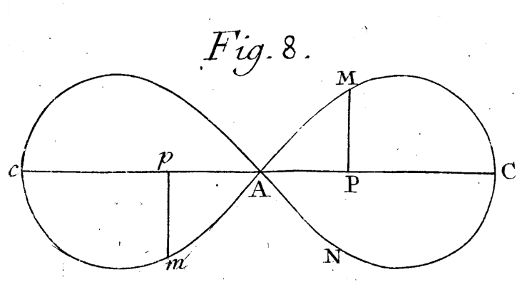
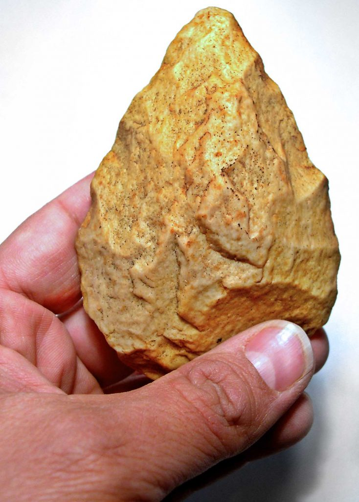
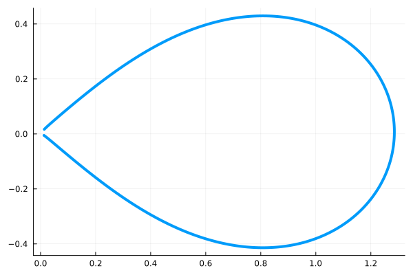
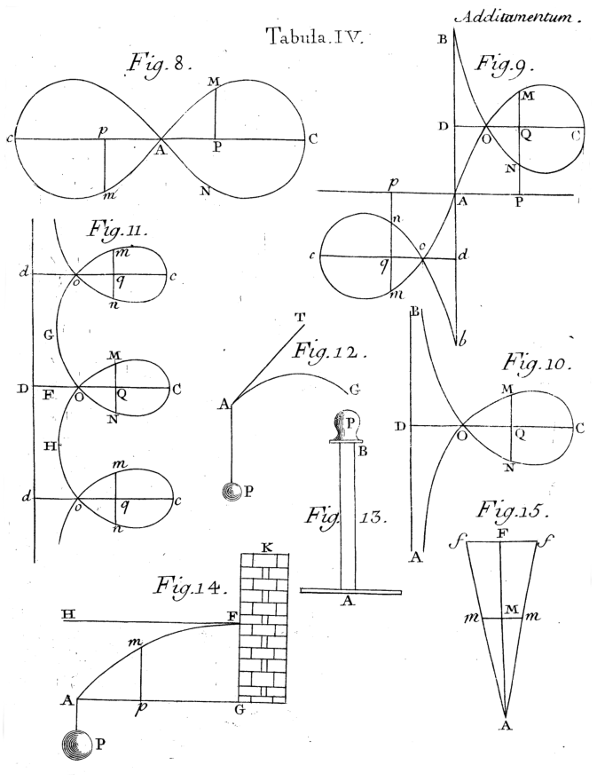
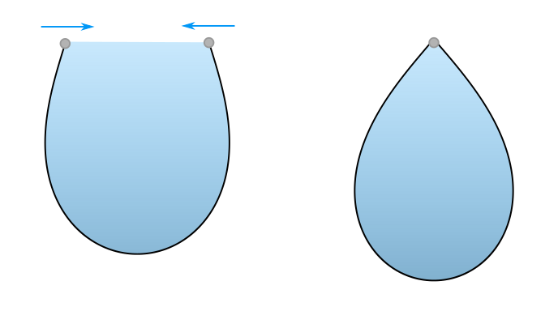

+++
title = "My Favorite Shape"
date = 2021-01-15

[extra]
math = true
image = "/blog/favorite-shape-01/favorite_shape_01_fig1.png"
+++

This is a love letter to my favorite shape, half of Euler's figure-eight ... or *Fig. 8*.



I know... it's a little weird to have a favorite shape. It's even weirder to be so specific about one's favorite shape. But bear with me, this is a really cool shape.

## Pre-history



It looks similar to some of the earliest tools humans made, the Acheulean hand axe.

Many of these early tools resemble the Euler's figure-eight. In particular cordiform (heart-shaped) and amygdaloidal (almond-shaped).

Many such hand axes were crafted to a great degree of precision and symmetry. This has led many to wonder if these axes were works of art in addition to being useful tools.

## Math

The mathematical formulation for solving for this shape is somewhat long. Since others have discussed the solution at great length and for brevity I'll simply place the parameterized solution here.


$$ x=a \sqrt{k+\cos t} $$

$$ y=\frac{a}{2} \int_{0}^{t} \frac{\cos u} {\sqrt{k+\cos u}} du $$

```julia
using Plots

k = 0.65223
dt = 0.000001
tlim = acos(-k)-dt
t = -tlim:dt:tlim  

x = @. sqrt(k + cos(t))
y = cumsum(@. cos(t)/sqrt(k + cos(t))*dt)/2

plot(x,y, aspect_ratio=1, lw=4, legend=:none)
savefig(joinpath(@__DIR__, "output", "favorite_shape_01_fig2.png"))
```



## Elastica - Elastic Curves

If take an elastic strip and curl it around so that the ends meet, it makes half of Euler's figure-eight. This shape minimizes the total curvature while still allowing the line to meet up end-to-end.

This shape is just one curve belonging to a family of curves called elastica or elastic curves. The study of elastic curves has puzzled the minds of many famous mathematicians, notably Galileo, Bernoulli, and Euler. Euler built on the analysis of Bernoulli and was able to characterize this family of curves completely.



## Lintearia - Water in a tarp

It turns out that there is another example in physics which produces this curve called lintearia (from the Latin for linen). Imagine taking a length of tarp and securing the ends to horizontal bars at the same height. Fill the tarp with water up to the bars. Imagine for a moment that the sides are capped magically or that the caps are sufficiently far away to not affect the behavior at the center of the tarp.

Without the water, the tarp would form a catenary curve. When you fill the tarp with water, the water pressure pushes outwards against the tarp. Importantly, the water pressure increases with depth causing the tarp to bulge out at the bottom. If the bars are drawn together, the shape created is half of Euler's figure-eight.



## Similar Curves

I'd be remiss to end this article without mentioning some very similar curves.

 * [The lemniscate of Bernoulli](https://mathcurve.com/courbes2d.gb/lemniscate/lemniscate.shtml)
 * [The convict curve](https://mathcurve.com/courbes2d.gb/syntractrice/syntractrice.shtml)

## References:

 * [Mathcurve.com LINTEARIA](https://mathcurve.com/courbes2d.gb/chainette/bachette.shtml)
 * [Mathcurve.com ELASTIC CURVE](https://mathcurve.com/courbes2d.gb/linteaire/linteaire.shtml)
