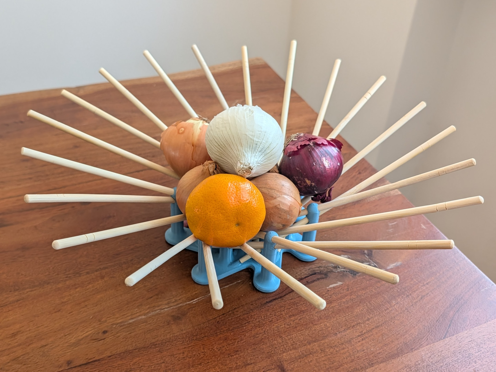

+++
title = "Chopstick Fruit Bowl"
date = 2026-05-10

[taxonomies]
tags = ["3D Printing"]

[extra]
image = "/blog/fruit-bowl-01/fruit_bowl_01_fig3.jpg"
+++

What do you do when you have 11 pairs of extra chopsticks?

Apparently, you design a 3D printed connector and turn them into a fruit bowl. The connector holds each chopstick at a slightly different angle, so the whole set fans out into a bowl shape once they're all inserted.

{{ fig_group(srcs=["fruit_bowl_01_fig1a.png", "fruit_bowl_01_fig1b.jpg"], alts=["Top-down view of the connector body with all 22 chopsticks radiating outward", "Top-down view of the printed connector with all 22 chopsticks inserted"]) }}

{{ fig_group(srcs=["fruit_bowl_01_fig2a.png", "fruit_bowl_01_fig2b.png", "fruit_bowl_01_fig2c.jpg"], alts=["Angled view of the connector body showing the chopsticks fanning outward and upward", "Close-up of a single connector joint holding a subset of chopsticks", "Angled view of the printed connector and chopsticks forming the bowl shape"]) }}

And here it is doing its job, holding a small haul of onions and a mandarin.

