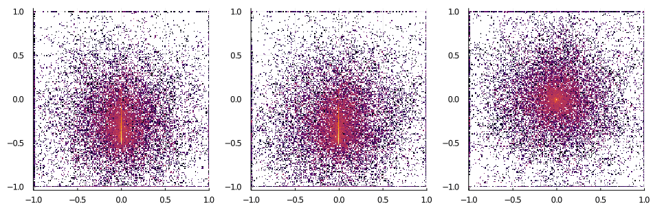
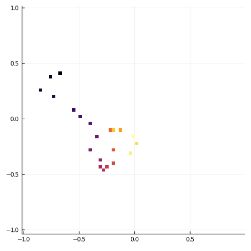
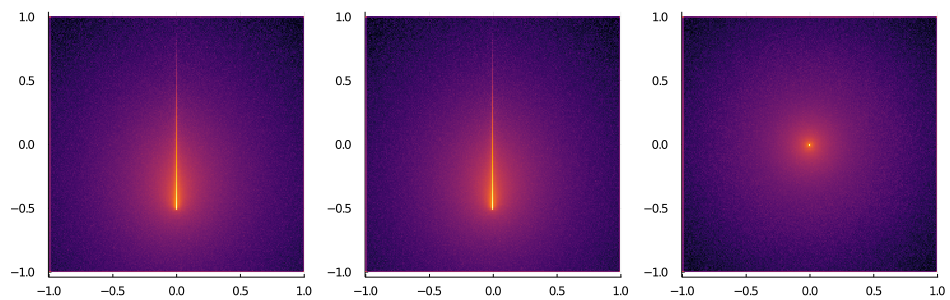
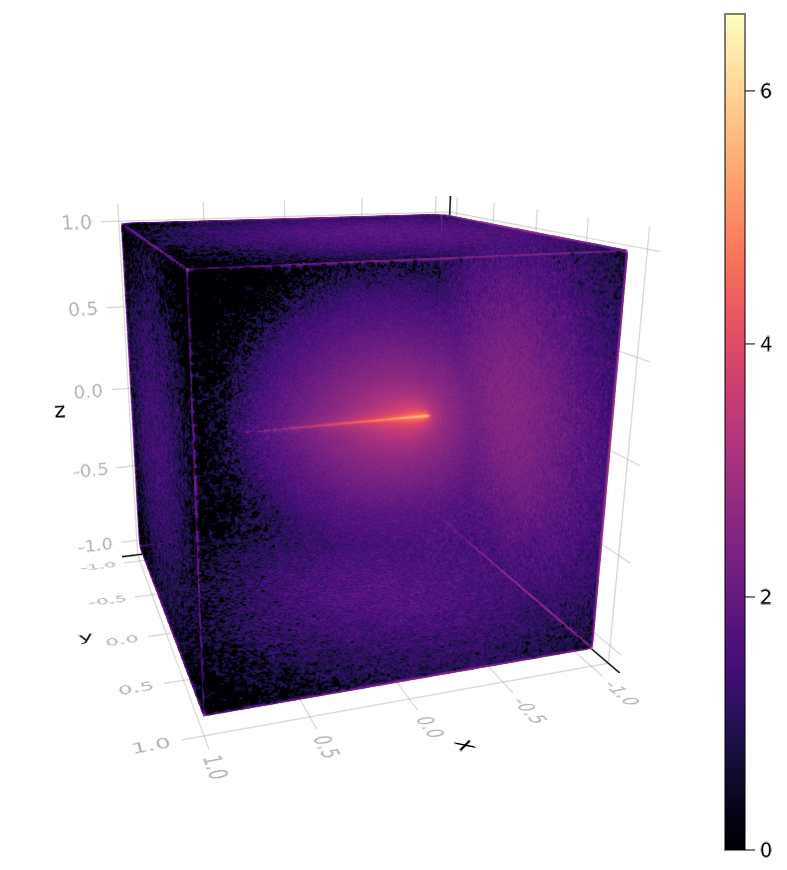

+++
title = "Monte Carlo Light Transport"
date = 2021-03-18

[taxonomies]
tags = ["Julia"]

[extra]
image = "/blog/light-transport-01/light_transport_01_fig1.gif"
+++

<!-- # Monte Carlo Light Transport -->

<!-- TODO: Simulation of energy accumulating in a turbid volumeSimulation of energy accumulating in a turbid volume -->

Monte Carlo methods are a class of algorithms that rely on random sampling to generate a result. These methods can obtain results for both random and deterministic processes. For example, the value of $\pi$ is deterministic, but by sampling random points within a square and testing if they fall within a circle you can estimate the value of $\pi$ (albeit quite slowly). For random processes like light scattering, Monte Carlo methods are a natural choice and can be quite versatile.

## [MCLightTransport.jl](https://github.com/search?q=MCLightTransport.jl&type=Repositories)

I wrote a small package in Julia called [MCLightTransport.jl](https://github.com/search?q=MCLightTransport.jl&type=Repositories) to simulate the propagation of photons through a turbid media. This is currently a very experimental package with many possible improvements and changes. It is currently only able to simulate light propagating through a uniform volume, but I'm hoping to add more capabilities soon. I'm not going to go into the details of how it works right now, but if you want to learn the basics Wikipedia has [a pretty good summary](https://en.wikipedia.org/wiki/Monte_Carlo_method_for_photon_transport#Implementation_of_photon_transport_in_a_scattering_medium) of how this algorithm works. For a more technical discussion, I highly recommend [Oregon Medical Laser Center's website](https://omlc.org/). They have several good resources including book chapters, class notes, and software for Monte Carlo light transport simulation. I based my work on the mc123.c script they've released.

The animation above and the images below represent the energy deposited in a turbid volume by a beam of light. Think of a laser beam submersed in a vat of milk. Simulated photons are launched from the same point and in the same direction each time. Each photon has a trajectory and at each step it jumps to a new location some distance along that trajectory. At each location the photon's trajectory can be altered (ie, scattered). As a simulated photon bumbles through the volume it deposits a portion of its energy at each location it visits. When the photon loses most of its weight, it has a chance of dying. Once a photon is dead, another is launched and the process repeats many, many times. Over time the estimate of the energy deposited at each location improves. The white spaces in the graphics are locations where no photons have visited.

The image below shows the contribution of a single photon. You can somewhat make out the random trajectory this particular photon took through the volume.

I'm really pleased with the resulting plots. There are certainly more succinct and informative ways to display this information. However, I quite like that it looks like a lightsaber illuminating smoke or fog. Even the graininess from the inherent randomness of this algorithm looks intentional.

<!-- TODO: A 3D plot of the light energy distribution -->
