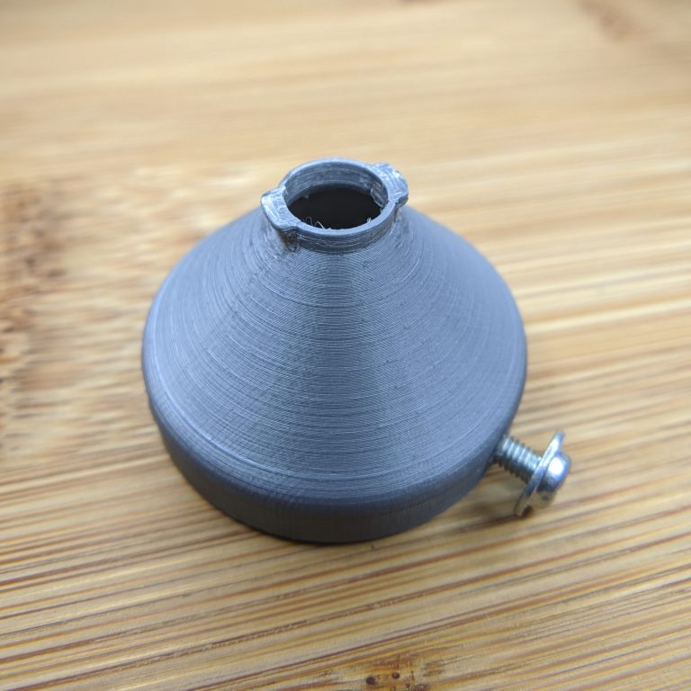

+++
title = "Cellphone Camera Microscope Adapter"
date = 2020-07-24

[taxonomies]
tags = ["3D Printing"]

[extra]
image = "/blog/microscope-adapter-01/microscope_adapter_01_fig1.jpg"
+++

A while back I picked up an old microscope—a Zeiss Photomicroscope II to be precise. I've had a long list of projects that I've been meaning to do related to this microscope, and this adapter for my cellphone camera is hopefully the first in a series of posts detailing these projects.

The first set of projects that I want to check off the list related to special image processing algorithms. So the first step in this journey is acquiring the images. While I was shopping for a camera to attach to my microscope, I was floored by how expensive many of the options were. I'm sure that the precision, quality, and special features are required for many applications, but all I wanted were pretty, high-definition photos. In the past, I held my phone to the microscope eyepiece, but this gets old quickly.
My first prototype adapter

I have a set of Moment lenses for my phone that attach via a bayonet mount to a specialized case. My first iteration of an adapter consisted of just the mounting feature attached to a cone. The base of the adapter fits around the microscope eyepiece and can be locked into place with three screws.

As many engineers know, CAD designs live in a universe devoid of scale, gravity, and the nuisance of manufacturing limitations. This adapter was to live at the top of the microscope with the screen of my phone pointing upwards. In this orientation, the weight of my phone would torque on the small printed tabs of the adapter. The solution was to prints supports which braced against the back of my phone. The supports lower the amount of force applied to the mounting tabs and prevents them from breaking.

Currently, the position and orientation of the adapter relative to the eyepiece are set with three screws with generous wiggle room. In the future, I'd like to print a 3rd version with hard stops that seat the adapter at the correct position.

{{ fig_group(srcs=["microscope_adapter_01_fig2.jpg", "microscope_adapter_01_fig3.jpg", "microscope_adapter_01_fig4.jpg", "microscope_adapter_01_fig5.jpg"], alts=["Close up of the Moment case interface with hard stops", "Adapter at Work", "Adapter mounted on eyepiece", "Image acquired from my cellphone"]) }}
