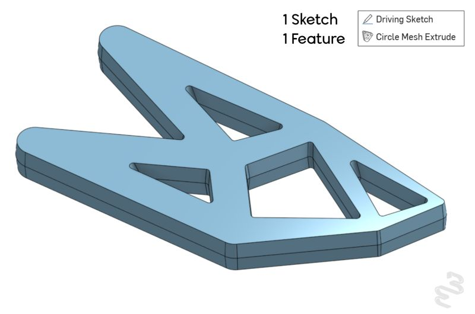
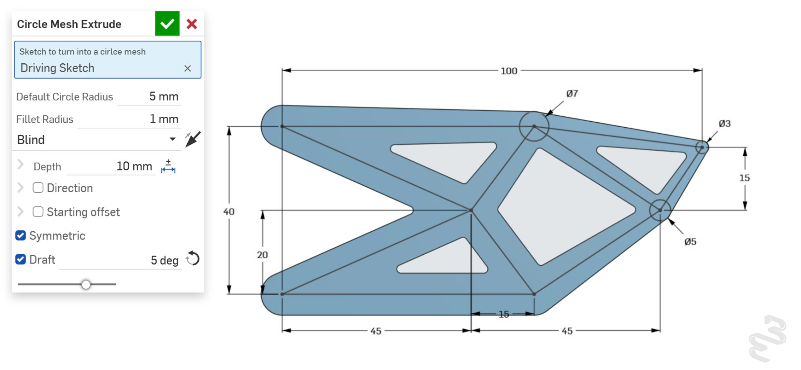

+++
title = "Circle Mesh Extrude: Vibe-Coding a Real FeatureScript Feature with Claude"
date = 2025-10-18

[taxonomies]
tags = ["CAD", "Onshape", "MCP", "Claude"]

[extra]
image = "/blog/onshape-circle-mesh-extrude-01/onshape_circle_mesh_extrude_01_fig2.jpg"
+++

Follow-up to [my last post](/blog/onshape-zonohedron-mcp-01/) on Onshape's FeatureScript MCP server. This time I built something a little more complex: a feature I'm calling Circle Mesh Extrude.

The input to this feature is a sketch with a network of line segments with circles centered at the endpoints. The feature will create a lattice structure with the width of each segment driven by the circles in the sketch. The feature interpolates the width linearly across each segment between its endpoints, and if a segment doesn't have a circle at one end, it falls back to a default width. The result is a skeletonized structure with tapered segments that follows whatever line network you feed it — thick where you've drawn big circles, thin where you haven't drawn anything at all.

## Swapping Copilot for Claude Code

With the [Zonohedron feature](/blog/onshape-zonohedron-mcp-01/), I mostly hand-coded the FeatureScript myself, with Copilot's free tier mainly helping me push through rough patches. This one is a lot more vibe-coded: I wrote the sketch-geometry handling for a single segment by hand, then handed the harder part off to Claude — extruding that logic across an entire mesh of segments and giving the result all the settings you'd expect from the built-in Extrude feature (draft angle, symmetric/one-sided options, and so on).

I've wanted a feature like this for a while, and it didn't take long to get working with the MCP-Claude connection. Now that it's built and tested, the AI's job is done. It behaves like any other feature in the toolbar: reusable, editable, shareable, with no dependency on the AI that helped write it.

## What Motivated This

I don't have a particular need for this feature currently. I was motivated to create this because I noticed a common geometric pattern emerging from structural topology optimization. Topology optimization takes a design space, a set of loads, and a stiffness or weight target, and iteratively removes material to produce the lightest structure that still holds up — the output is usually a branching, organic mesh that looks more like bone than a machined part. The more complicated outputs of topology optimization are often only possible to manufacture with additive manufacturing processes. Often engineers have to take the result of the topology optimization and manually create a shape that can be manufactured with a laser cutter or a mill. I added an input for a fillet radius which sets the radius of inside corners of the lattice structure to alleviate stress concentrations and to allow the lattice structure to be manufacturable with an end mill. 

## The Future

It's still early — I'm stress testing it now, so if you want to try breaking it, I'd be curious to hear how you managed it. Try it out here: [Circle Mesh Extrude](https://cad.onshape.com/documents/ada8454ceed4a56122b326f2/w/e578df3e64d26f494e6a34cd/e/7809dba24f87d4f8ddf8523e).

Onshape has hinted at adding topology optimization. When that capability is released I would like to try out a workflow of optimizing the part and recreating the geometry quickly with Circle Mesh Extrude. It's perhaps too much to ask for now, but I would be really interested if I could directly optimize the parameters of a part design iteratively. That is, instead of recreating a part based on the results of topology optimization, directly update a part's design within a simulation loop. If you cleverly select the features used to generate the part being simulated, the end result could be both a topology optimized and manufacturable component.
