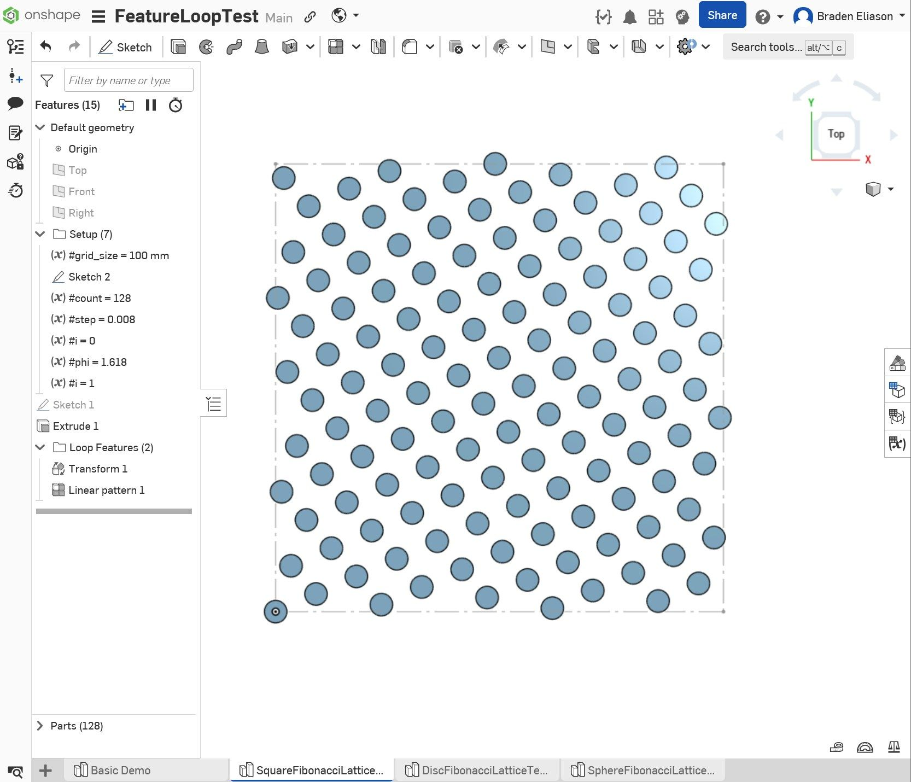
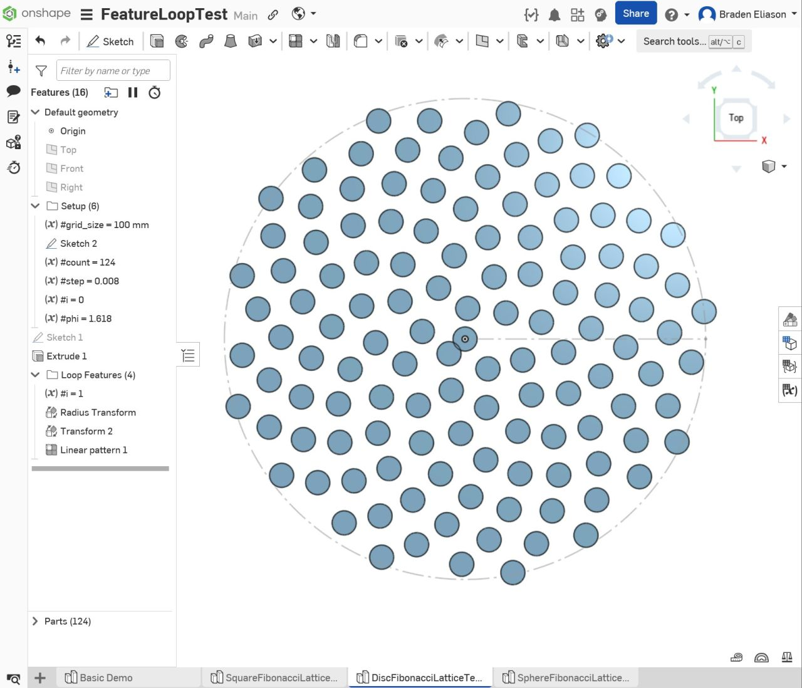
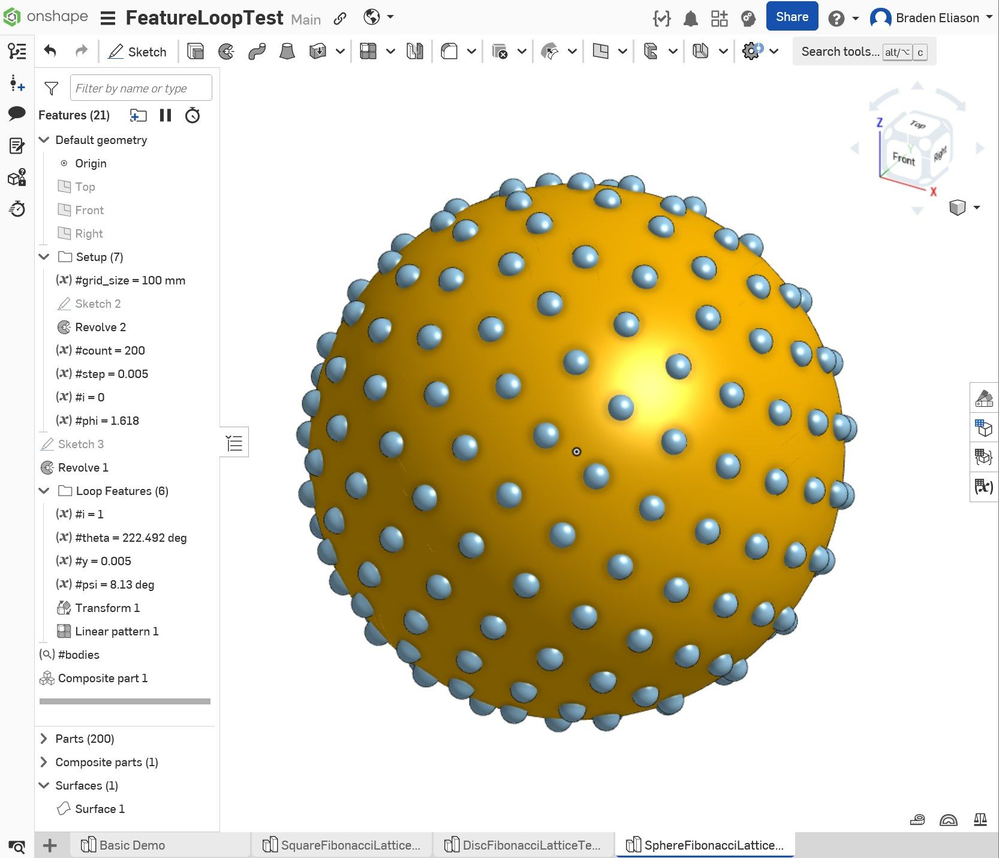

+++
title = "A For Loop Hiding in Onshape's Linear Pattern"
date = 2025-09-14

[taxonomies]
tags = ["CAD", "Onshape"]

[extra]
image = "/blog/onshape-loop-pattern-01/onshape_loop_pattern_01_fig3.png"
+++

Onshape's Linear Pattern feature has a checkbox called "Reapply features." Normally when you pattern a feature (rather than just a body), Onshape copies the *result* of that feature to each new location instead of re-running the feature's logic from scratch. *Reapply features* tells Onshape to actually regenerate the seed feature at every single instance, dependencies and all. Most of the time you'd only reach for this if an "up to next" extrude or similar end condition needs to re-evaluate against each instance's own local geometry.

It turns out this checkbox also gives you a loop.

## The Trick

If you define a variable feature that updates a variable of the same name (eg, `#i = #i + 1`) and that variable-setting feature is one of features being patterned, something interesting happens with *Reapply features* turned on. Each pattern instance re-executes the variable update and everything downstream of it. In effect you get a `for` loop without writing any FeatureScript.

The Linear Pattern itself isn't doing any of the actual patterning on its own in this setup — it's not moving copies around in the usual sense. It's just the container that forces N repeated evaluations to happen. All the real geometric work happens in the features living inside it, driven entirely by the equations and features that depend on `i`.

Much credit for this technique goes to [Evan Reese](https://www.theonsherpa.com/), who runs [The Onsherpa](https://www.theonsherpa.com/) and has been building and teaching Onshape workflows like this for a while.

## Square, Disc, and a Spherical Fibonacci Lattice

I tried this out on three examples of equation-driven lattices.

The square pattern is the simplest case: each iteration creates a transformed copy of the initial part and shifts the copy's position in x and y as a function of variable `i`. If the x-position is outside of the square bounds on one side, it wraps around to the other side.

The disc pattern does something similar but radially — each iteration adds a copy of the initial part at a radius and angle that's a function of `i`.

The one I'm most pleased with is a Fibonacci sphere pattern. A Fibonacci sphere is a way of distributing points roughly evenly across the surface of a sphere using the golden angle. The points are positioned on rings spaced evenly along the z-axis of the sphere, one ring for each point. On each ring, the point is positioned the golden angle around the z-axis from the previous point (approximately 137.5 degrees).

[Demo here](https://cad.onshape.com/documents/c42b33d6f8229732b2aaccea/) if you want to see it in action.

## Driving Sketches with `i`

The demos above were using simple disks and spheres with a transform-copy feature to demonstrate the loop. It's also possible to drive sketch dimensions with the variable `i`. 

For this to work, the linear pattern feature needs to include the variable feature which increments `i` (ie, `#i = #i + 1`), the sketch, and any extrudes or other features that make use of the sketch.

{{ fig_group(srcs=["onshape_loop_pattern_01_fig4a.png", "onshape_loop_pattern_01_fig4b.png"], alts=["Sketch dimension driven by `i`", "Result of a loop with a sketch driven by `i`"]) }}

## FeatureScript Would Be the "Real" Way to Do This

To be clear, this is not the idiomatic way to write procedural CAD in Onshape. [FeatureScript](https://cad.onshape.com/FsDoc/intro.html) — Onshape's own built-in language, the same one their standard toolbar features are written in — has actual `for` loops and pattern-generation functions like `opPattern` for exactly this kind of equation-driven geometry. If I wanted this to be robust, reusable, and fast, I'd write it in FeatureScript.

But there's something fun about finding a way to implement such loop without touching FeatureScript.
