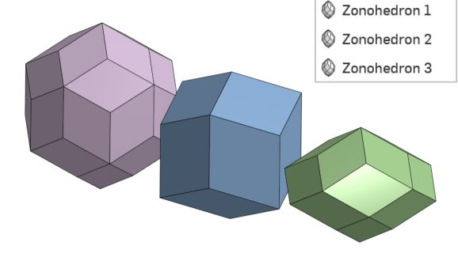
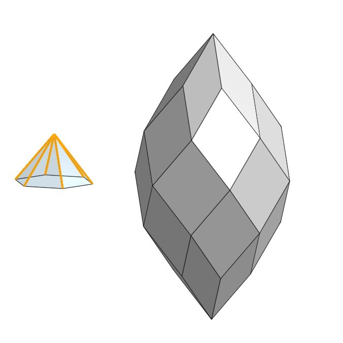

+++
title = "Vibe-Coding My First FeatureScript Feature: Zonohedron"
date = 2025-10-02

[taxonomies]
tags = ["CAD", "Onshape", "MCP"]

[extra]
image = "/blog/onshape-zonohedron-mcp-01/onshape_zonohedron_mcp_01_fig1.jpg"
+++

I've wanted to learn [FeatureScript](https://cad.onshape.com/FsDoc/intro.html) for a while now. It's Onshape's own built-in language — the same one their standard toolbar features like Extrude and Fillet are written in — and it's genuinely the "real" way to build custom, reusable, parametric CAD features. In a [previous post](/blog/onshape-loop-pattern-01/) I explored how a `for` loop can be created in Onshape using only the feature tree, no code. I just never had enough reason or motivation to push through the initial learning hurdles.

What finally got me over that hump was Onshape's newly released FeatureScript MCP server, which launched through Onshape Labs. MCP, short for [Model Context Protocol](https://www.anthropic.com/news/model-context-protocol), is an open standard that lets an AI agent call external tools through a common interface instead of every integration being a one-off. Onshape's version of this hands an AI agent a specific set of tools for working with FeatureScript: generate code from a natural-language description.

I used the free tier of Copilot for this first attempt. It wasn't doing all the work — more like clearing away just enough of the syntax friction that the hand-coding part stayed fun. I'll give Claude a try soon for something more ambitious.

## Zonohedra

In a short amount of time I had my first real custom feature working: a Zonohedron generator.

A zonohedron is a convex polyhedron built out of centrally symmetric faces. Zonohedra can be generated from a set of lines in 3D space each pointing in their own direction. Sweep the first segment along the second, and you get a parallelogram. Sweep that parallelogram along a third segment, and you get a parallelepiped — a squished 3D box. Keep going, sweeping the resulting volume along each additional segment in turn, and each new sweep adds a "zone" to the shape. More formally this is a Minkowski sum of line segments, but "sweep, sweep, sweep" is a perfectly accurate way to visualize it.

To create zonohedra in FeatureScript, I'm actually computing each face of the zonohedra as separate quadrilaterals and then enclosing the final volume of these separate faces.

Many named polyhedra are also zonohedra, including a cube. Four segments along a cube's long diagonals give you a rhombic dodecahedron. If you carefully select five different line segments, the resulting zonohedra is a rhombic icosahedron, and a special set of six segments gives a rhombic triacontahedron.

I also played with using this to build zonohedron-based dome (ie, zomes) structures. There are some interesting architectural projects that use this zome geometry to build houses and garden structures.

