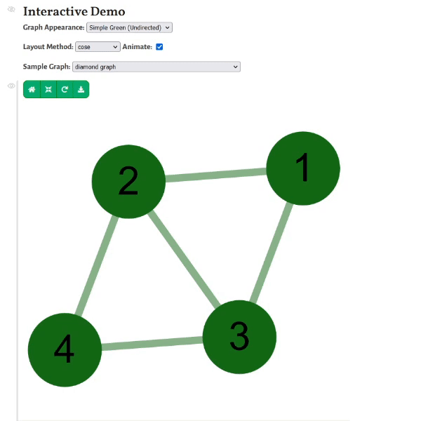

+++
title = "Graph Vizualization in Pluto Notebooks"
date = 2021-09-28

[taxonomies]
tags = ["Julia", "Pluto.jl"]

[extra]
image = "/blog/pluto-graphviz-01/pluto_graphviz_01_fig1.gif"
+++

<!-- # Graph Vizualization in Pluto Notebooks -->

I made an experimental [Pluto.jl](https://github.com/search?q=Pluto.jl&type=Repositories) notebook to display graphs using [Cytoscape.js](https://js.cytoscape.org/). Cytoscape is a graph visualization library written in pure JavaScript. I used the package [HypertextLiteral.jl](https://github.com/search?q=HypertextLiteral.jl&type=Repositories) to generate HTML output inside of a Pluto notebook. The output HTML pane has four buttons to fit, center, redraw, and download the graph. You can also swap out different graphs, styles, and layout methods interactively.

Currently this project is just a prototype which you can view and download on my Github: PlutoGraphViz. There are many features of Cytoscape which I have not implemented yet. If you found this project interesting, leave me a star on Github.

## Animated Demo
<!-- TODO: Image -->

